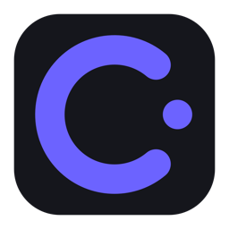
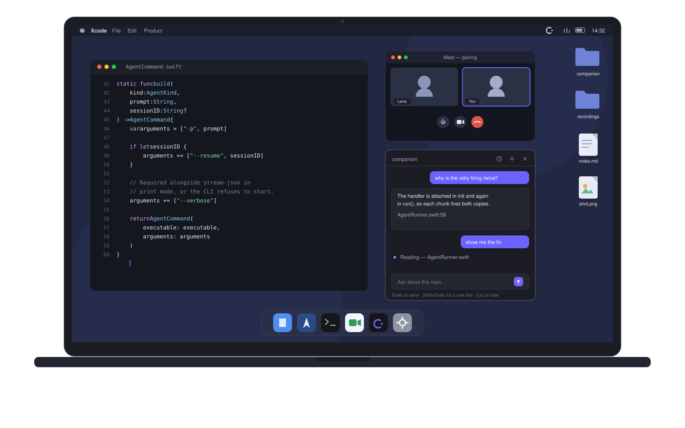
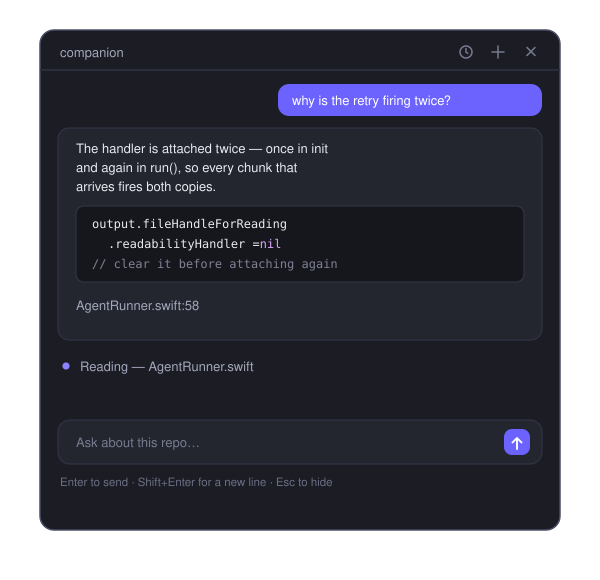

<p align="center">
  
</p>

<h1 align="center">Companion</h1>

<p align="center"><b>A pair programming assistant for macOS.</b></p>

<p align="center">
  Ask about the code you and your pair are working through, in a panel that sits
  beside your editor instead of on top of the conversation.
</p>

<p align="center">
  <a href="https://souhaibbenfarhat.github.io/companion/">Website</a> ·
  <a href="https://github.com/SouhaibBenFarhat/companion/releases">Releases</a> ·
  <a href="#install">Install</a>
</p>



## Why

Pairing over a call is one screen and two people reading it. The moment you go
looking something up — a browser tab, a chat window, a second editor — the code
your pair was following slides off screen and you both lose the thread.

Companion answers **next to** the code. It is a small panel you summon with a
shortcut, ask a question, and dismiss. It knows the repo you are in, so you can
ask about the file in front of you without pasting anything.

Three things follow from being built for pairing:

- **It never takes focus.** The panel accepts your typing while your editor
  stays the active app, so your cursor doesn't jump and the call app sees no
  window switch.
- **It reads the real repo.** Not a screenshot, not the visible 40 lines — the
  actual files on disk, plus `git diff` for what you've changed this session.
- **It is read-only by default.** An assistant should not edit the code you are
  demonstrating to someone. Turn editing on when you want it.

It also stays out of the shared view: macOS screen capture skips the window, so
opening it does not change what your pair sees.

<p align="center">
  
</p>

## How it works

Companion doesn't call a model itself. It drives a coding agent CLI (command
line interface) you already have installed, running headless in your repo.

- **No API (Application Programming Interface) key.** Claude Code or Codex
  already holds your subscription login. Nothing to store in the app, nothing
  to leak, no per-token bill.
- **No context management to build.** Deciding what to read and when to compact
  a long thread is the hard part of this kind of tool. The agent already does it.
- **Follow-ups keep the thread.** Each conversation remembers the agent's
  session, so "no, do it the other way" reaches an agent that still knows what
  it read.

## Install

```
brew install --cask souhaibbenfarhat/tap/companion   # first install
brew upgrade --cask companion                        # upgrade
```

macOS 14 (Sonoma) or later, Apple Silicon. Then one agent, signed in:

```
npm install -g @anthropic-ai/claude-code   # or
npm install -g @openai/codex
```

## Use

| Shortcut | Action |
| --- | --- |
| <kbd>⌥</kbd><kbd>Space</kbd> | Show / hide the panel |
| <kbd>↩</kbd> | Send |
| <kbd>⇧</kbd><kbd>↩</kbd> | New line |
| <kbd>Esc</kbd> | Hide the panel |

Pick the repo from the panel header or the menu bar icon. Conversations are
listed per repo, so opening the panel while pairing on one project shows only
its threads. Everything stays in
`~/Library/Application Support/Companion` — no sync, no upload.

## Develop

```
npm --prefix web install
npm --prefix web run dev          # Vite dev server on :5173
COMPANION_WEB_URL=http://localhost:5173 swift run Companion
```

Without `COMPANION_WEB_URL` the app loads the built interface from its bundle,
or from `web/dist` when running out of the source tree.

```
swift test              # CompanionCore unit tests
scripts/build-app.sh    # dist/Companion.app + dist/Companion-arm64.zip
```

Swift owns the window and the subprocess; the interface is React and TypeScript
inside a `WKWebView`, served over a custom scheme.

## Licence

MIT
